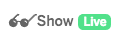

# Deploying Botkit to Glitch!

You are setting up a complete copy of the Botkit code and a set of sample "skills" -- everything you need to get your bot online and working!
This process takes a few seconds, as Glitch downloads all the code and sets it up for you.

Check the upper left corner of your screen. When the  becomes a , your deploy has completed.
Click  to open your new app in a new window, and then navigate back to your Botkit Studio tab to complete setting up your bot!

(You can also click the `Logs` button to watch the progress as Glitch does its magic)

# Having trouble?
The [Botkit Studio knowledge base](https://botkit.groovehq.com/) contains in-depth information about using Botkit Studio, or you can [contact us](https://botkit.groovehq.com/knowledge_base/topics/contact-us-23) directly.

# Not using Botkit Studio?
If you deployed this starter kit directly from Github and did not use Botkit Studio to auto-configure it, [here's a walk-through](https://github.com/howdyai/botkit/blob/master/docs/provisioning/slack-events-api.md) of configuring Botkit by hand.

## Related Links
* [Botkit Studio](https://www.botkit.ai/)
* [Botkit Studio Documentation](https://botkit.groovehq.com/)
* [Using Botkit Studio on Glitch](https://botkit.groovehq.com/knowledge_base/topics/hosting-your-bot-on-glitch)
